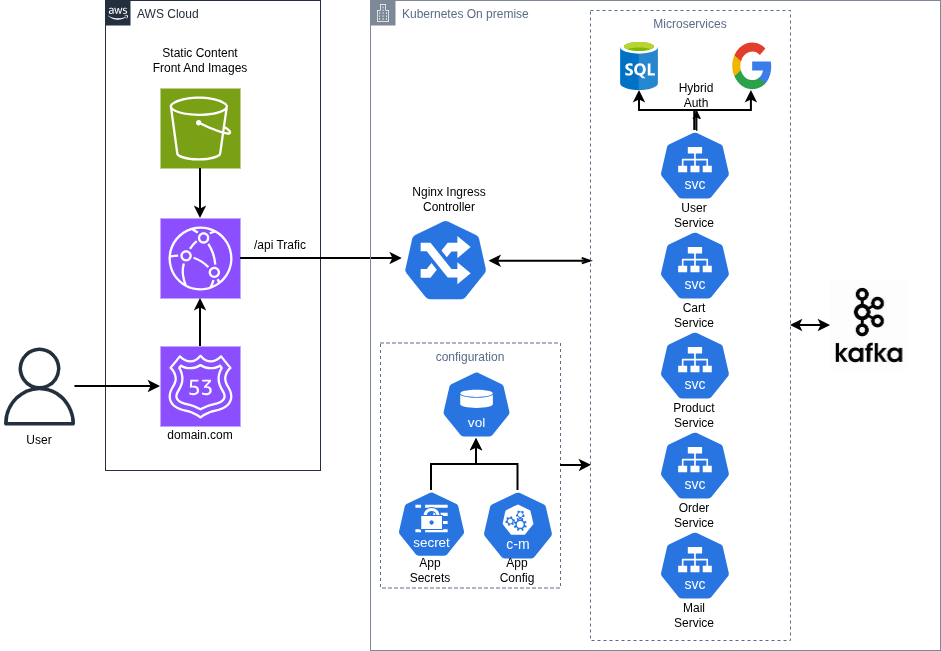

# 🚀 Microservices Platform – Arquitectura Modular para Producción

> Una plataforma de referencia que integra microservicios backend, frontend Angular moderno e infraestructura cloud-native. Diseñada para demostrar cómo construir sistemas distribuidos escalables, resilientes y mantenibles.

<div align="center">

[](https://www.oracle.com/java/)
[](https://spring.io/projects/spring-boot)
[](https://angular.io)
[](https://kubernetes.io)
[](LICENSE)

[Blog Técnico](#-características-técnicas) • [Documentación](#-documentación) • [Inicio Rápido](#-inicio-rápido) • [Estructura](#-estructura-del-proyecto) • [Contribuir](#-contribuciones)

</div>

---

## 🏗️ Arquitectura Visual

<p align="center">
  
</p>

### Capas principales

| Capa                        | Tecnología                     | Responsabilidad                                |
| --------------------------- | ------------------------------- | ---------------------------------------------- |
| **Frontend Público** | AWS (S3 + CloudFront + Route53) | Distribución global, caché, entrada pública |
| **API Gateway**       | Nginx Ingress Controller        | Enrutamiento, balanceo, rate limiting          |
| **Microservicios**    | Spring Boot + Kubernetes        | Lógica de negocio, datos, eventos             |
| **Persistencia**      | H2 (dev) / PostgreSQL (prod)    | Almacenamiento transaccional y auditoría      |
| **Mensajería**       | Apache Kafka (Strimzi)          | Comunicación desacoplada entre servicios      |

---

## 📋 Tabla de Contenidos

- [Visión General](#-visión-general)
- [Características Técnicas](#-características-técnicas)
- [Servicios](#-servicios)
- [Inicio Rápido](#-inicio-rápido)
- [Estructura del Proyecto](#-estructura-del-proyecto)
- [Stack Tecnológico](#-stack-tecnológico)
- [Patrones Avanzados](#-patrones-avanzados)
- [Flujos de Usuario](#-flujos-de-usuario)
- [Documentación](#-documentación)
- [Roadmap](#-roadmap)

---

## 🎯 Visión General

Este proyecto **no es un tutorial simple**. Es una arquitectura de producción completa que demuestra:

✅ **Separación clara de responsabilidades**: Frontend estático en cloud, lógica de negocio en microservicios
✅ **Escalabilidad por diseño**: Cada servicio es independiente, versionable y reemplazable
✅ **Seguridad multinivel**: Autenticación híbrida, cookies HTTPOnly, RBAC centralizado
✅ **Experiencia moderna**: Angular 21 SSR con traducción multiidioma, UI coherente
✅ **Resilencia operacional**: Idempotencia, auditoría Envers, mensajería asíncrona con Kafka
✅ **Infraestructura como código**: Kubernetes YAML, ConfigMap, Secrets, RBAC bindings

---

## ⚡ Características Técnicas

### Backend

- **Autenticación híbrida**: Base de datos local + Google OAuth2 con JWT en cookies HTTPOnly
- **Autorización RBAC**: Control granular de acceso mediante roles en Kubernetes y base de datos
- **Auditoría automática**: Todas las modificaciones de usuario/roles registradas con Envers
- **Idempotencia**: Procesamiento seguro de webhooks duplicados (constraint DB + AOP)
- **Eventos asíncronos**: Publicación/consumo mediante Kafka para desacoplamiento
- **OpenAPI 3.0**: Documentación automática de APIs REST
- **Manejo robusto de errores**: DTOs compartidos, excepciones tipadas, fallbacks graceful

### Frontend

- **Angular 21 Standalone**: Arquitectura moderna sin NgModules, tree-shaking mejorado
- **Server-Side Rendering (SSR)**: SEO-friendly, performance optimizado
- **Traducción centralizada**: 4 idiomas (ES, EN, DE, FR) con diccionarios JSON
- **Lazy Loading**: Rutas bajo demanda, bundle inicial <100KB
- **Sistema visual consistente**: PrimeNG 21.1.6, tokens SCSS, componentes reutilizables
- **Gestión de estado ligero**: Servicios de estado global, no Redux pesado
- **Auth Guards**: Protección de rutas, rehidratación automática de sesión

### Infraestructura

- **Container-ready**: Docker para cada servicio, multi-stage builds optimizados
- **Kubernetes native**: Manifests YAML con ConfigMap, Secrets, StatefulSet para Kafka
- **Service discovery**: DNS interno, comunicación inter-servicio via Feign
- **Observabilidad**: Logs estructurados, metrices readiness/liveness probes
- **Escalabilidad horizontal**: Stateless services con réplicas automáticas

---

## 🔧 Servicios

### Backend Microservices

| Servicio                  | Descripción                                | Endpoints Clave                                     |
| ------------------------- | ------------------------------------------- | --------------------------------------------------- |
| **User Service**    | Autenticación, perfiles, roles, analítica | `/auth/login`, `/me`, `/users/{id}`           |
| **Product Service** | Catálogo, categorías, búsqueda           | `/products`, `/categories`, `/search`         |
| **Cart Service**    | Carritos por usuario, cálculos             | `/cart`, `/cart/items`                          |
| **Order Service**   | Pedidos, historial, webhook pago            | `/orders`, `/orders/{id}`, `/payment/webhook` |
| **Mail Service**    | Notificaciones vía Kafka                   | Listener async de eventos                           |
| **Core Module**     | Seguridad, DTOs, excepciones                | Librería compartida en Maven                       |

### Frontend Screens

| Pantalla               | Funcionalidad                                  |
| ---------------------- | ---------------------------------------------- |
| **Landing**      | Hero, valor proposición, CTA                  |
| **Auth**         | Login local, OAuth2 Google, registro           |
| **Home**         | Dashboard con carrito, accesos rápidos        |
| **Catalog**      | Listado pagionado, filtros, categorías        |
| **Cart**         | Revisión, ajuste cantidades, checkout         |
| **Order Detail** | Estado, historial, reorden                     |
| **User Detail**  | Perfil, roles, edición, auditoría            |
| **Admin**        | Gestión usuarios, pedidos, SEO, comunicación |
| **Blog**         | Documentación técnica de la plataforma       |

---

## 🚀 Inicio Rápido

### Requisitos previos

```bash
Java 17+
Maven 3.8+
Node.js 18+
Docker & Docker Compose
(Opcional) Kubernetes 1.25+, kubectl
```

### Desarrollo local

**1. Clonar y navegar**

```bash
git clone https://github.com/tuorg/microservices-template.git
cd microservices-template
```

**2. Backend – Compilar servicios**

```bash
mvn clean install -DskipTests
```

**3. Frontend – Instalar dependencias**

```bash
cd front
npm install
```

**4. Iniciar todo en desarrollo**

```bash
# Terminal 1: Backend (Spring Boot)
mvn spring-boot:run -pl user-service

# Terminal 2: Frontend (Angular)
cd front && npm start

# Terminal 3: Base de datos (H2) – Automática en Spring Boot
```

Acceder a:

- **Frontend**: http://localhost:4200
- **API User Service**: http://localhost:8080/api/users
- **OpenAPI Docs**: http://localhost:8080/swagger-ui.html

### Despliegue en Kubernetes

```bash
# Aplicar manifests
kubectl apply -f k8s/

# Verificar pods
kubectl get pods -l app=microservices-template

# Port-forward para desarrollo
kubectl port-forward svc/api-gateway 8080:80
```

---

## 📁 Estructura del Proyecto

```
microservices-template/
├── services/
│   ├── user-service/        # Autenticación, perfiles
│   ├── product-service/     # Catálogo, búsqueda
│   ├── cart-service/        # Carritos por usuario
│   ├── order-service/       # Pedidos, webhooks
│   ├── mail-service/        # Notificaciones Kafka
│   └── core/                # DTOs, seguridad, excepciones
├── front/
│   ├── src/app/
│   │   ├── core/            # Servicios globales, auth, HTTP
│   │   ├── features/        # Módulos de negocio lazy-loaded
│   │   ├── shared/          # Componentes, pipes, directives
│   │   └── layout/          # Header, sidebar, footer
│   ├── public/resources/
│   │   └── i18n/            # Diccionarios JSON (es, en, de, fr)
│   └── package.json
├── k8s/
│   ├── user-service.yaml
│   ├── product-service.yaml
│   ├── order-service.yaml
│   ├── cart-service.yaml
│   ├── mail-service.yaml
│   ├── configmap.yaml
│   ├── secrets.yaml
│   └── ingress.yaml
├── doc/
│   └── diagrams/            # Arquitectura, flujos
├── pom.xml                  # Maven parent
└── README.md
```

---

## 🛠️ Stack Tecnológico

### Backend

```
Java 17
Spring Boot 4.0.6 (Spring Framework 6.0.x)
Spring Cloud 2025.1.1 (Eureka, Feign, Config)
Spring Security 6.0.x (OAuth2, JWT)
Spring Data JPA + Hibernate 6.x
Envers (Auditoría automática)
H2 Database (desarrollo)
PostgreSQL (producción recomendado)
Apache Kafka + Strimzi
Docker & Kubernetes
Jenkins (CI/CD)
```

### Frontend

```
Angular 21 (Standalone Components)
TypeScript 5.x
PrimeNG 21.1.6 (Componentes UI)
Bootstrap Icons
SCSS (Sistema de diseño con tokens)
RxJS (Reactive programming)
Standalone API (sin NgModules)
Angular Universal (SSR)
```

### Infraestructura

```
Docker (Containerización)
Kubernetes 1.25+ (Orquestación)
Nginx Ingress Controller (API Gateway)
Apache Kafka (Strimzi operator)
AWS (S3, CloudFront, Route53)
ConfigMap & Secrets (Configuración)
```

---

## 🎯 Patrones Avanzados

### 1. **Idempotencia en Webhooks**

```
Problema: Pagos duplicados si el webhook falla y se reintenta
Solución: Constraint UNIQUE en BD + AOP para deduplicación
Beneficio: Procesamiento seguro de eventos no confiables
```

### 2. **Auditoría con Envers**

```
Automática para entidades User y Role
Rastreo: quién, qué, cuándo, antes/después
Crítico para: Compliance, debugging, forensics
```

### 3. **Mensajería Asíncrona**

```
Eventos: user-created, order-paid, mail-sent
Topología: Productores (User, Order) → Kafka → Consumidor (Mail)
Ventaja: Desacoplamiento, resilencia, escalabilidad
```

### 4. **Autenticación Híbrida**

```
Opción 1: Email + Password (Base de datos local)
Opción 2: Google OAuth2 (OIDC)
Resultado: JWT en cookie HTTPOnly (seguro contra XSS)
```

### 5. **Server-Side Rendering (SSR)**

```
Angular Universal: Pre-renderizado en servidor
SEO: Meta tags, OpenGraph, structured data
Performance: First Contentful Paint ~1.2s
```

---

## 👥 Flujos de Usuario

### 1️⃣ Autenticación & Sesión

```
Usuario → Landing → Login/OAuth → JWT Cookie → State Rehidratado → Dashboard
```

### 2️⃣ Exploración Catálogo

```
Dashboard → Catalog (paginated) → Ver detalles → Agregar a carrito → Notificación
```

### 3️⃣ Checkout & Pago

```
Carrito → Resumen → Payment Mock → Webhook disparado → Evento Kafka → Mail async
```

### 4️⃣ Administración

```
Admin → Users/Orders/SEO → Ver detalles → Editar → Auditado en BD → Evento Kafka
```

---

## 📚 Documentación

- **[Blog Técnico](/frontend/src/app/features/blog/)** – Explicación detallada de servicios y patrones
- **[OpenAPI Docs]** – Swagger generado automáticamente (`/swagger-ui.html`)
- **[Diagrama de Arquitectura](./doc/diagrams/)** – Visual de la topología
- **[Kubernetes Manifests](./k8s/)** – YAML comentado para despliegue
- **[Core DTOs](backend/services/core/)** – Contratos entre servicios

---

## 🗺️ Roadmap

| Estado | Feature                           |
| ------ | --------------------------------- |
| ✅     | Core arquitectónico funcional    |
| ✅     | Autenticación híbrida + JWT     |
| ✅     | Microservicios desacoplados       |
| ✅     | Frontend SSR + traducción        |
| ✅     | Auditoría e idempotencia         |
| ✅     | Kubernetes ready                  |
| ⏳     | Monitoring (Prometheus + Grafana) |
| ⏳     | Distributed tracing (Jaeger)      |
| ⏳     | CI/CD pipeline (GitHub Actions)   |
| ⏳     | Testes e2e (Cypress)              |

---

## 🤝 Contribuciones

Las contribuciones son bienvenidas. Por favor:

1. Fork el repositorio
2. Crea una rama (`git checkout -b feature/amazing-thing`)
3. Commit tus cambios (`git commit -m 'Add amazing thing'`)
4. Push a la rama (`git push origin feature/amazing-thing`)
5. Abre un Pull Request

---

## 📄 Licencia

Distribuido bajo la licencia MIT. Ver [LICENSE](LICENSE) para más detalles.

---

## 👨‍💻 Autor

Creado como plataforma de referencia para arquitectura de microservicios moderno.

<div align="center">
