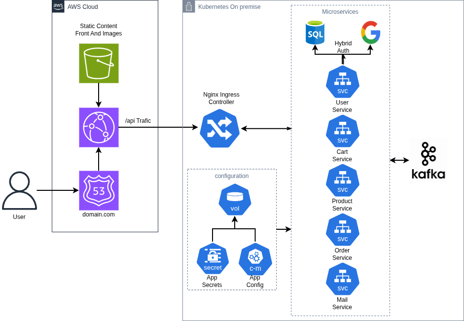

# Microservices Platform

Este proyecto es una **plataforma de referencia basada en microservicios**. El foco no está en un dominio de negocio complejo, sino en una arquitectura realista con **frontend estático en AWS**, **tráfico /api hacia Kubernetes on-premise**, **servicios desacoplados** y una capa de **seguridad e integración** pensada para producción.

El diagrama de arquitectura describe dos bloques principales: contenido estático distribuido desde la nube y una zona de microservicios detrás de un **Nginx Ingress Controller**, con servicios como **user**, **cart**, **product**, **order** y **mail**.

  

---

## Arquitectura objetivo

* **AWS Cloud** para servir contenido estático, imágenes y entrada pública del dominio.
* **Route53 + CloudFront + S3** como capa de distribución y aceleración del frontend.
* **Kubernetes on-premise** para alojar la zona de microservicios.
* **Nginx Ingress Controller** para enrutar el tráfico `/api` hacia el clúster.
* **Hybrid Auth** con autenticación local en base de datos y login con Google.
* **Secrets y App Config** para centralizar configuración sensible y parámetros de entorno.

---

## Tecnologías principales

* **Java 17 + Spring Boot**
* **Spring Security** con autenticación híbrida base de datos + Google
* **Docker** para empaquetar cada servicio
* **Kubernetes** como orquestador del clúster on-premise
* **AWS** para distribución del frontend y recursos estáticos
* **Jenkins** para automatizar despliegues

---

## Flujo principal

1. El usuario entra por el dominio público y recibe el contenido estático desde AWS.
2. Las peticiones `/api` llegan al Ingress del clúster Kubernetes.
3. El Ingress distribuye el tráfico entre los microservicios de negocio.
4. La autenticación híbrida decide si el acceso se valida contra la base de datos o contra Google.
5. La configuración sensible se inyecta mediante Secrets y los parámetros no sensibles mediante App Config.

---

## Estado del proyecto

La plataforma está en evolución, pero la base arquitectónica ya está orientada a un despliegue profesional: cloud para estáticos, Kubernetes para los servicios, seguridad centralizada y configuración separada del código.

---

## Conclusión

Este proyecto sirve como base para un sistema distribuido moderno, con separación clara entre la entrega pública, la infraestructura de ejecución y los servicios de negocio.
